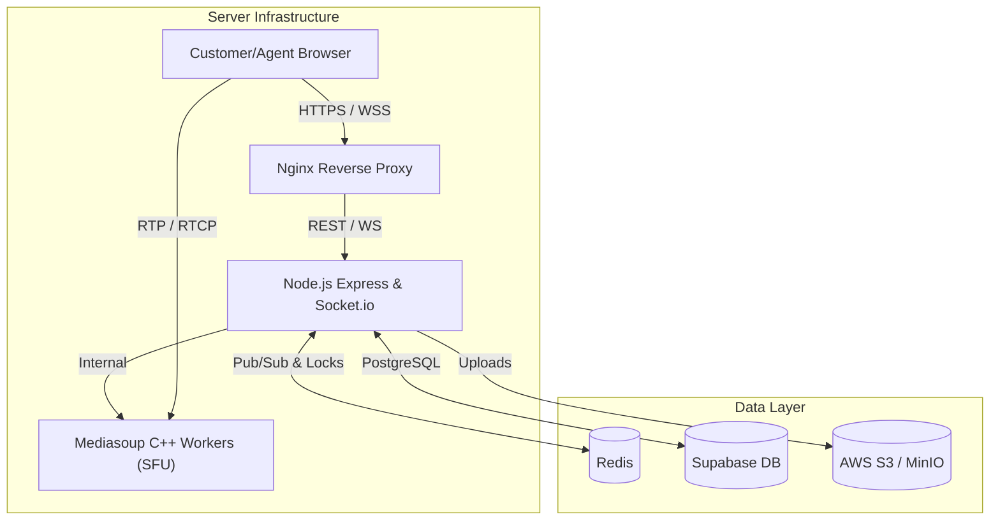

# SupportLens - Real-Time Video Support Platform

SupportLens is a proprietary, self-hosted WebRTC real-time video calling platform engineered specifically for customer support workflows. It integrates session management, real-time media routing, synchronous chat, role-based access control, and advanced telemetry—completely independent of third-party video APIs.

## 🌐 Deployed URLs
- **Frontend URL:** `http://16.171.22.54`
- **Backend API URL:** `http://16.171.22.54/api`

## 🔐 Credentials
| Role | Email | Password |
|---|---|---|
| **Admin** | `admin@atomquest.dev` | `Admin@123` |
| **Agent** | `agent@atomquest.dev` | `Agent@123` |

## 🛠 Tech Stack

### **Frontend**
- **React 18** (TypeScript / TSX)
- **Vite** (Build Tool)
- **TailwindCSS** (Styling)
- **shadcn/ui & lucide-react** (UI Components & Icons)
- **socket.io-client** (Real-time events)
- **mediasoup-client** (WebRTC Media)

### **Backend**
- **Node.js** (TypeScript)
- **Express.js** (REST API)
- **Socket.io** (WebSocket Server)
- **Mediasoup** (C++ SFU WebRTC Workers)

### **Infrastructure & Database**
- **PostgreSQL** (Database hosted on Supabase)
- **Redis** (Pub/Sub signaling & Distributed Locks)
- **AWS S3 / MinIO** (Object Storage for Files & Recordings)
- **Docker & Docker Compose** (Containerization)
- **Nginx** (Reverse Proxy)

## 🏗 Architecture Diagram

## 🎯 Features Status

| Feature | Status | Description |
|---|---|---|
| **Authentication & RBAC** | ✅ Completed | Secure login for Agents and Admins using JWT + Argon2. |
| **Agent Dashboard** | ✅ Completed | Session history list and generation of new customer invite links. |
| **Customer Waiting Room** | ✅ Completed | Pre-flight hardware checks and waiting room (no-login required). |
| **Active Call Interface** | ✅ Completed | Dynamic Media Grid, Control Dock, and collapsible Auxiliary Drawer. |
| **Real-Time Chat** | ✅ Completed | DB-backed real-time chat broadcast during the call. |
| **File Sharing** | ✅ Completed | Multipart upload to S3 directly from the chat interface. |
| **Admin Dashboard** | ✅ Completed | Global session view with force-terminate functionality for Admins. |
| **Reconnect Handling** | ✅ Completed | Connection state recovery and automatic ICE restart on network drop. |
| **Zombie Session Cleanup** | ✅ Completed | Server-side ping/pong to teardown abandoned sessions. |
| **Telemetry & Observability** | ✅ Completed | Real-time extraction of RTT, jitter, and packet loss metrics. |

## ⭐ Extra / Enhanced Features
- **Client-Side High-Fidelity Recording:** Replaced complex backend FFmpeg muxing with a precise frontend `MediaRecorder` pipeline. It accurately records exactly what the agent sees and hears (including the custom layout, screen sharing, and remote participant audio) directly into a `.webm` file and automatically uploads it to S3.
- **Admin Force Terminate & Agent "End Session":** Dedicated capabilities for Admins and Agents to forcibly tear down all active WebRTC transports, clean up sockets, and correctly update the session history immediately.
- **Distributed Mutex for Joins:** Redis atomic locks prevent race conditions when a user opens the invite link multiple times simultaneously.
- **Dynamic S3 Resolution:** Fail-safe mechanisms fall back dynamically based on S3 API connectivity.
