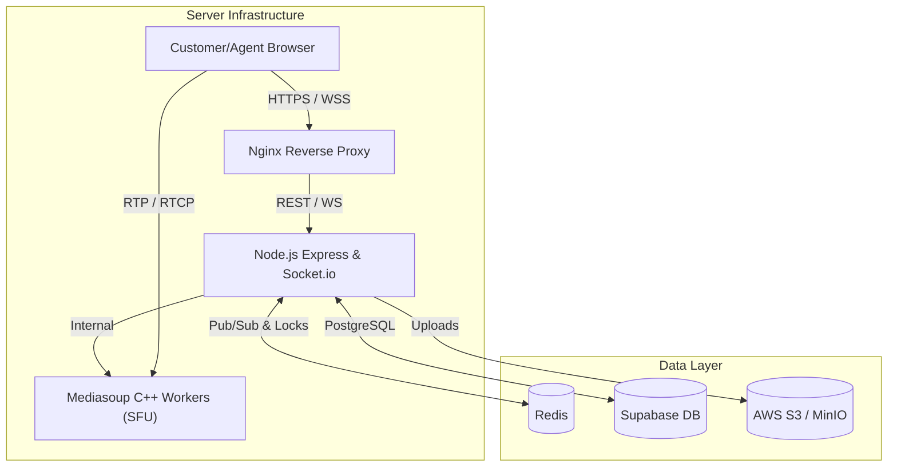

# SupportLens - Real-Time Video Support Platform

SupportLens is a proprietary, self-hosted WebRTC real-time video calling platform engineered specifically for customer support workflows. It integrates session management, real-time media routing, synchronous chat, role-based access control, and advanced telemetry—completely independent of third-party video APIs.

## 🚀 Deployed URLs
- **Frontend & Backend (Nginx Reverse Proxy):** `http://16.171.22.54`

## 🔐 Credentials
| Role | Email | Password |
|---|---|---|
| **Admin** | `admin@atomquest.dev` | `Admin@123` |
| **Agent** | `agent@atomquest.dev` | `Agent@123` |

## 🛠 Tech Stack
### **Frontend**
- **Framework:** React 18 with Vite (TypeScript / TSX)
- **Styling:** TailwindCSS, `shadcn/ui`, `lucide-react` icons
- **State Management & WebRTC:** `socket.io-client`, `mediasoup-client`

### **Backend & Infrastructure**
- **Server:** Node.js (TypeScript), Express, `socket.io`
- **WebRTC SFU:** `mediasoup` (C++ workers orchestrated by Node.js)
- **Database:** PostgreSQL (hosted on Supabase)
- **State & Signaling:** Redis (Pub/Sub for scaling, BullMQ)
- **Storage:** AWS S3 (for files and recording storage)
- **Deployment:** Docker & Docker Compose, Nginx (Reverse Proxy)

## 🏗 Architecture Diagram

## 🎯 Core Features (Status)

| Feature | Status | Description |
|---|---|---|
| 1. Project Setup & Infrastructure | ✅ Completed | Monorepo setup with Node, React, Postgres, Redis, and Mediasoup. |
| 2. Database Schema & Migrations | ✅ Completed | Tables for users, sessions, participants, chat. UUID keys. |
| 3. Authentication & RBAC | ✅ Completed | JWT + Argon2 auth. Socket middleware for strict RBAC. |
| 4. Session Lifecycle Management | ✅ Completed | Invite link generation. Paginated history with durations. |
| 5. Distributed Signaling with Redis | ✅ Completed | Redis Pub/Sub integration for horizontal scaling without split-brain. |
| 6. Mediasoup SFU — Media Engine | ✅ Completed | H.264/VP8 support. Round-robin worker selection. |
| 7. TURN/STUN Server (Coturn) | ❌ Pending | External STUN/TURN server deployment for strict NATs. |
| 8. Frontend — Agent Dashboard | ✅ Completed | Session history list and generation of new customer invite links. |
| 9. Frontend — Customer Pre-Flight | ✅ Completed | Ephemeral tokens (no-login) with hardware checks and waiting room. |
| 10. Frontend — Active Call Interface | ✅ Completed | Dynamic Media Grid, Control Dock, and collapsible Auxiliary Drawer. |
| 11. Real-Time Chat & Persistence | ✅ Completed | DB-backed real-time chat broadcast. |
| 12. File Sharing | ✅ Completed | Multipart upload to S3 without Node.js memory buffering. |
| 13. Server-Side Recording | ✅ Completed | (Now migrated to Client-Side for accuracy—see Extra Features below) |
| 14. Reconnect Handling | ✅ Completed | Connection state recovery and `pc.restartIce()` automation. |
| 15. Zombie Session Cleanup | ✅ Completed | Server-side ping/pong to teardown abandoned sessions. |
| 16. Distributed Mutex for Joins | ✅ Completed | Redis atomic locks to prevent race conditions on invite links. |
| 17. Telemetry & Observability | ✅ Completed | RTT, jitter, and packet loss monitoring via Prometheus/Grafana. |
| 18. Admin Dashboard | ✅ Completed | Global session view with force-terminate functionality. |
| 19. Security & TLS Hardening | ✅ Completed | Nginx proxy with restricted routing and socket authorization. |
| 20. End-to-End Deployment | ✅ Completed | Containerized via Docker Compose to AWS EC2 instance. |

## ⭐ Extra / Enhanced Features
- **Client-Side High-Fidelity Recording:** Replaced complex backend FFmpeg muxing with a precise frontend `MediaRecorder` pipeline. It accurately records exactly what the agent sees and hears (including the custom layout, screen sharing, and remote participant audio) directly into a `.webm` file and automatically uploads it to S3.
- **Admin Force Terminate & Agent "End Session":** Dedicated capabilities for Admins and Agents to forcibly tear down all active WebRTC transports, clean up sockets, and correctly update the session history immediately.
- **Dynamic S3 Resolution:** Fail-safe mechanisms fall back dynamically based on S3 API connectivity.
